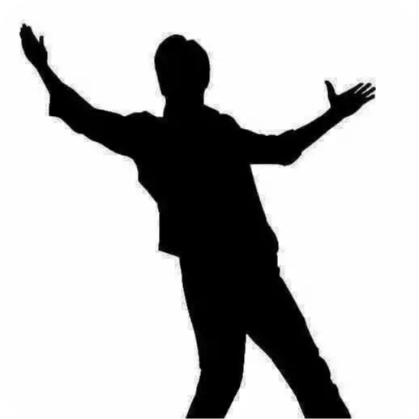

<h2 align="left">Hi 👋, I'm Amin</h2>

###

<h4 align="center">A passionate frontend developer from Iran</h4>

###

  
  
  

###

<h3 align="left">My Skills:</h3>

###

 

  

###

<h3 align="left">Connect with me:</h3>

###

  
  
  

###

###

<h3 align="left">I'm a passionate Junior Front-End Developer with a keen interest in creating responsive and user-friendly websites. I love exploring new web technologies and improving my skills every day. Currently, I'm working with HTML, CSS, JavaScript, and React to build amazing web experiences. Feel free to check out my projects and contributions</h3>

###

 

###
